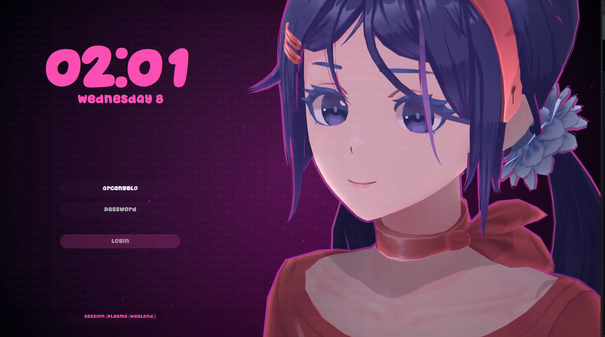

# MiSide SDDM Theme


[](https://ko-fi.com/henryarcangelo)

MiSide SDDM Theme is a login screen theme for [SDDM](https://github.com/sddm/sddm/), made to look like the menu in **MiSide**, featuring our favorite (crazy) character **Mita 💕**  

It’s built with **Qt6**, lightweight, and super easy to tweak via the config files.  

Check out a preview: 



---

## Abs

- Styled just like the MiSide menu ❤️  
- Easy to tweak via config files  
- Lightweight and fully Qt6 ready  
- Made to make you smile every time you log in 😉  

---

## Installation
 ```bash
 git clone https://github.com/arcangel0/MiSide-sddm-theme.git
 cd MiSide-sddm-theme
 chmod +x setup.sh
 sudo ./setup.sh
 ```  

 ### Reboot and enjoy the login screen with Mita <3 

 <hr> 

 Made with ❤️ by [ARCANGEL0](https://github.com/ARCANGEL0)
